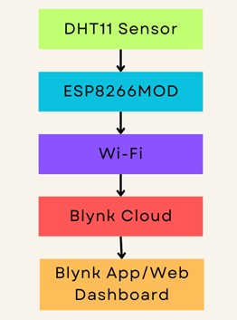
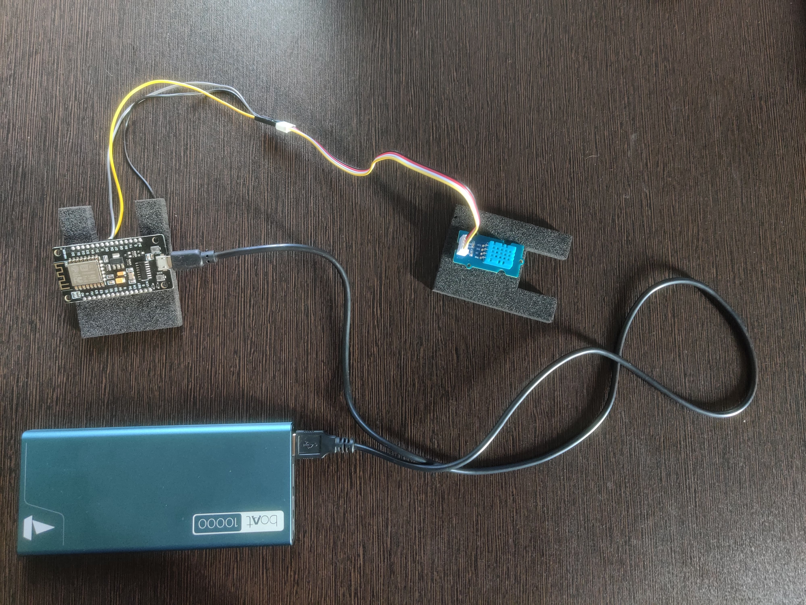

# 📌 Smart Room Environment Monitoring System

An IoT-based project using **ESP8266**, **DHT11 sensor**, and the **Blynk IoT platform** to monitor temperature and humidity in real time.
Built as part of the **Edge Data Analytics / IoT Lab Assignment**.

---

## 📖 Project Overview

This system continuously measures **temperature** and **humidity**, sends the data to the **Blynk Cloud**, and displays it on both mobile and web dashboards.
Users also receive alerts when environmental conditions exceed safe thresholds.

---

## 🧰 Components Used

### **Hardware**

* ESP8266 (NodeMCU / ESP8266MOD)
* DHT11 Temperature & Humidity Sensor
* Breadboard
* Jumper Wires

### **Software**

* Arduino IDE
* Blynk IoT Platform (Mobile + Web Dashboard)
* Required Libraries:

  * `ESP8266WiFi.h`
  * `BlynkSimpleEsp8266.h`
  * `DHT.h`
  * `BlynkTimer.h`

---

## 🏗️ System Architecture

**Data Flow:**

1. DHT11 captures temperature & humidity.
2. ESP8266 reads the sensor values.
3. The microcontroller sends data to the Blynk Cloud via Wi-Fi.
4. Blynk Dashboard displays real-time values.
5. Alerts trigger when:

   * Temperature > **33°C**
   * Humidity > **70%**

---

## 🔌 Circuit Diagram

*(Add your circuit diagram image inside the `assets/` folder and reference it below)*

```

```

---

## 💻 Code

The full Arduino code is available in:

👉 `code/environment_monitoring.ino`

---

## 🌐 Protocols Used

* **GPIO** – Read data from DHT11
* **UART** – Serial communication
* **Wi-Fi (802.11)** – Internet connectivity
* **HTTP / Blynk API** – Communicates with cloud server
* **Blynk Virtual Pins** – Sends sensor data & logs alerts

---

## 📷 Project Snapshots

You can include images after uploading them:

```


```

---

## 🚨 Alerts & Notifications

Blynk sends notifications using **Event Logs**:

* `temp_alert` – when temperature > 33°C
* `humidity_alert` – when humidity > 70%

These notifications are visible on:

* Mobile App
* Web Dashboard
* Email

---

## 🧪 Results

* Real-time temperature and humidity displayed
* Notifications triggered under unsafe conditions
* Dashboard visualization on Blynk
* Stable readings every **2 seconds**

---

## 🛡️ Privacy & Security Considerations

* Wi-Fi SSID and password must **not** be hardcoded in public repositories
* Blynk Auth Token should be kept confidential
* Remove your real credentials before pushing code
* Use secured Wi-Fi networks to prevent data sniffing

---

## 📄 Folder Structure

```
Smart-Room-Environment-Monitoring/
│
├── code/
│   └── environment_monitoring.ino
│
├── report/
│   └── IoT Lab Report.pdf
│
├── assets/
│   ├── circuit_diagram.png
│   ├── dashboard_screenshot.png
│   └── hardware_setup.jpg
│
└── README.md
```

---

## 📝 Conclusion

This IoT-based Smart Room Monitoring System provides an efficient, real-time solution for tracking environmental conditions. With the ESP8266 + Blynk platform, cloud connectivity becomes seamless, making the project ideal for home automation, server rooms, greenhouses, and more.

---
